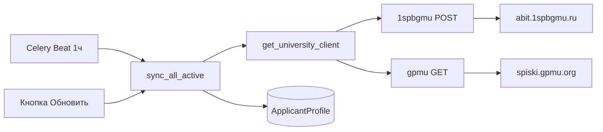

# Источники данных о поступающих

Документ описывает, как приложение получает списки абитуриентов из медицинских университетов.

## Общая схема



Каждый **медицинский университет** хранит `api_config` с полем `provider`, определяющим клиент.

Каждое **направление** хранит:
- `filter_params` — параметры запроса (уникальны для provider)
- `min_fetch_score` — порог остановки пагинации (по умолчанию 200)
- `seats` — количество бюджетных мест (из API или seed)

## Пороговая пагинация

Списки отсортированы по конкурсным баллам по убыванию. Приложение **не скачивает весь список**, а останавливается, когда встречает абитуриента с баллом **строго ниже** `min_fetch_score` направления.

**Исключение для нулевых баллов:** абитуриенты с `0` баллов в начале списка (олимпиадники, БВИ) **не вызывают остановку**. Они всегда сохраняются. Остановка срабатывает только на первом абитуриенте с баллом `> 0` и `< min_fetch_score`.

Пример (порог 200):

| Позиция | Баллы | Действие |
|---------|-------|----------|
| 1–3     | 0     | Сохранить (олимпиадники) |
| 4–500   | 310…200 | Сохранить |
| 501     | 199   | **Остановка**, дальше не качаем |

---

## Provider: `1spbgmu` — Первый мед (СПб)

**URL:** `https://abit.1spbgmu.ru`

### api_config

```json
{
  "provider": "1spbgmu",
  "base_url": "https://abit.1spbgmu.ru",
  "csrf_page": "/hod-priema/spiski-postupayushih/",
  "list_endpoint": "/applcompetlist/page/",
  "referer": "https://abit.1spbgmu.ru/hod-priema/spiski-postupayushih/"
}
```

### Алгоритм

1. **GET** `csrf_page` → извлечь `csrftoken` из cookie или HTML
2. **POST** `list_endpoint` с JSON-телом:

```json
{
  "limit": 100,
  "offset": 0,
  "csrfmiddlewaretoken": "<token>",
  "sedprofile_name": "Педиатрия",
  "sfaculty_name": "Педиатрический факультет",
  "splacekindname": "Бюджет (Общий конкурс)",
  "srecruitment": "ВПО-2026"
}
```

3. Пагинация: `offset += 100`, пока не сработает порог или `rows` пустой
4. Заголовки: `X-CSRFToken`, `Referer`, `User-Agent`

### Направления (seed)

| Направление    | filter_params |
|----------------|---------------|
| Педиатрия      | `sedprofile_name`, `sfaculty_name`, `splacekindname`, `srecruitment` |
| Лечебное дело  | аналогично, другой факультет/профиль |

**Места:** Лечебное дело — 135, Педиатрия — 15 (задаётся в seed, API не возвращает)

### Маппинг полей ответа

| API поле       | ApplicantProfile |
|----------------|------------------|
| `suniqcode` / `_code` | `abiturient_id` |
| `_position`    | `position` |
| `nsummark`     | `nsummark` |
| `npriority_ssp`| `npriority_ssp` (строка → int) |
| `sstatus_ssp`  | `sstatus_ssp` |
| `ncons4enr`    | `has_enrollment_consent` |

### Пример curl

```bash
# 1. CSRF
curl -c cookies.txt \
  -H "User-Agent: Mozilla/5.0 ..." \
  -H "Referer: https://abit.1spbgmu.ru/hod-priema/spiski-postupayushih/" \
  "https://abit.1spbgmu.ru/hod-priema/spiski-postupayushih/"

# 2. Список
curl -X POST https://abit.1spbgmu.ru/applcompetlist/page/ \
  -H "Content-Type: application/json" \
  -H "X-CSRFToken: <token>" \
  -b "csrftoken=<token>" \
  -d '{"limit":100,"offset":0,"sedprofile_name":"Педиатрия",...}'
```

---

## Provider: `gpmu` — Педиатрический (СПб)

**URL:** `https://spiski.gpmu.org`

### api_config

```json
{
  "provider": "gpmu",
  "base_url": "https://spiski.gpmu.org",
  "page_size": 100
}
```

### Алгоритм

1. **GET** `/api/pod/group/{group_id}?page={n}&page_size=100`
2. Пагинация: `page += 1`, пока не сработает порог или страница неполная
3. CSRF не требуется

### Направления (seed)

| Направление    | group_id | URL |
|----------------|----------|-----|
| Лечебное дело  | `kg_4`   | `/api/pod/group/kg_4?page=1&page_size=100` |
| Педиатрия      | `kg_16`  | `/api/pod/group/kg_16?page=1&page_size=100` |

**Места:** берутся из `seats.total` в ответе API при каждой синхронизации

### Маппинг полей ответа

| API колонка (рус.) | ApplicantProfile |
|--------------------|------------------|
| `Уникальный код` | `abiturient_id` |
| (порядок в списке) | `position` |
| `Сумма конкурсных баллов` | `nsummark` |
| `Приоритет` | `npriority_ssp` (строка → int) |
| `Участвует в конкурсе` | `sstatus_ssp`: `✓` → «Участвует в конкурсе», иначе «На рассмотрении» |
| `Состояние договора` / `Согласие на зачисление` | `has_enrollment_consent`: `✓` → true |

### Структура ответа

```json
{
  "kg_id": "kg_4",
  "name": "Лечебное дело (...)",
  "seats": { "total": 52, "enrolled": 0, "available": 52 },
  "columns": ["Уникальный код", "Сумма конкурсных баллов", ...],
  "rows": [
    {
      "Уникальный код": "1255996",
      "Сумма конкурсных баллов": "0",
      "Приоритет": "1",
      "Состояние заявления": "Принято"
    }
  ]
}
```

### Особенность: олимпиадники с 0 баллов

Первые строки могут иметь `"Сумма конкурсных баллов": "0"` при основании приёма БВИ. Они остаются в списке и **не прерывают** загрузку по порогу.

### Пример curl

```bash
curl "https://spiski.gpmu.org/api/pod/group/kg_4?page=1&page_size=100"
curl "https://spiski.gpmu.org/api/pod/group/kg_16?page=1&page_size=100"
```

---

## Обработка ошибок (общая)

| Ситуация | Поведение |
|----------|-----------|
| Сеть, timeout, SSL | Retry ×3, exponential backoff |
| HTTP 429 | Читать `Retry-After`, записать в `SyncJob.next_retry_at` |
| HTTP 5xx | Retry ×3 |
| HTTP 4xx (кроме 429) | Fail без retry |

## Rate limit

- **Внутренний:** `sync_interval_seconds` (по умолчанию 3600). Celery Beat раз в час. Кнопка «Обновить сейчас» обходит через `force=True`.
- **Внешний (429):** уважается всегда, даже при `force=True`.

## Seed при запуске

Команда `ensure_seed_data` (вызывается в Docker entrypoint после migrate):

1. **Первый мед (СПб)** — 2 направления (135 и 15 мест)
2. **Педиатрический (СПб)** — 2 направления, provider gpmu

Идемпотентна: `get_or_create` + обновление `filter_params` / `seats` при расхождении.

## Файлы кода

| Файл | Назначение |
|------|------------|
| `apps/admissions/clients/university_client.py` | Клиент 1spbgmu |
| `apps/admissions/clients/gpmu_client.py` | Клиент GPMU |
| `apps/admissions/clients/factory.py` | Выбор клиента по provider |
| `apps/admissions/clients/parsers.py` | Парсинг row → ApplicantProfile |
| `apps/admissions/services/sync_service.py` | Оркестрация синхронизации |
| `apps/universities/seed.py` | Начальные МУ и направления |
